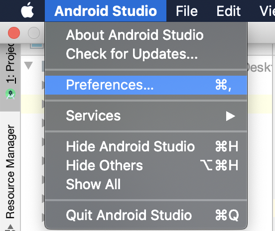
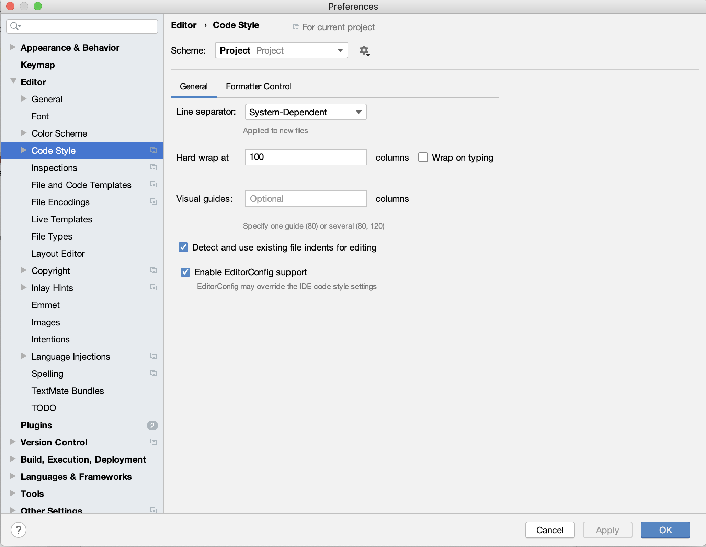
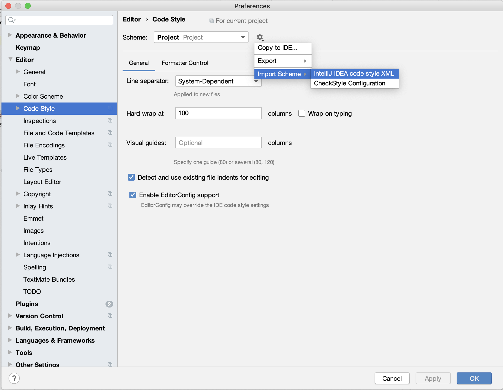
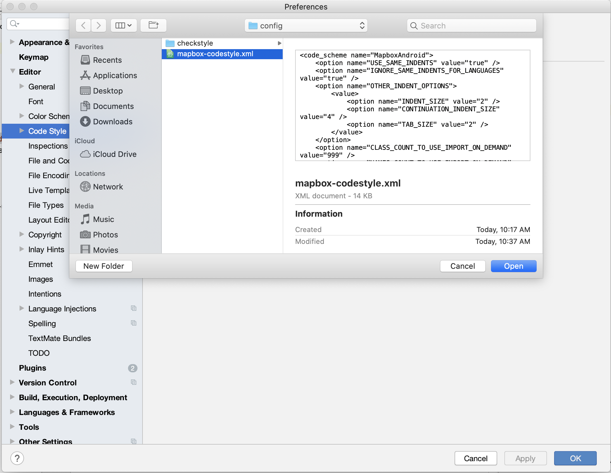
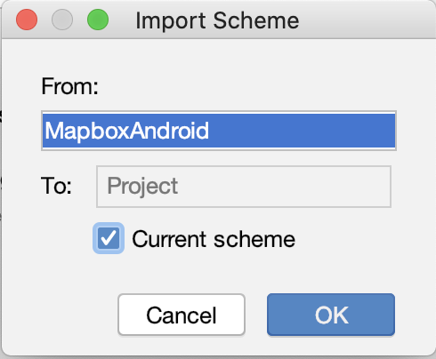

# Codestyle Setup

Mapbox uses proper codestyle files to enforce the same codestyle throughout the codebase.

## Configuring codestyle.

**For Mac**

Go to `Android Studio -> Preferences`

Click on `Code Style`

Click on `Settings Icon -> Import Scheme -> Intellij IDEA code style XML`

Select `mapbox-java-codestyle.xml` and click on `Open`

Select the checkbox

Click Ok