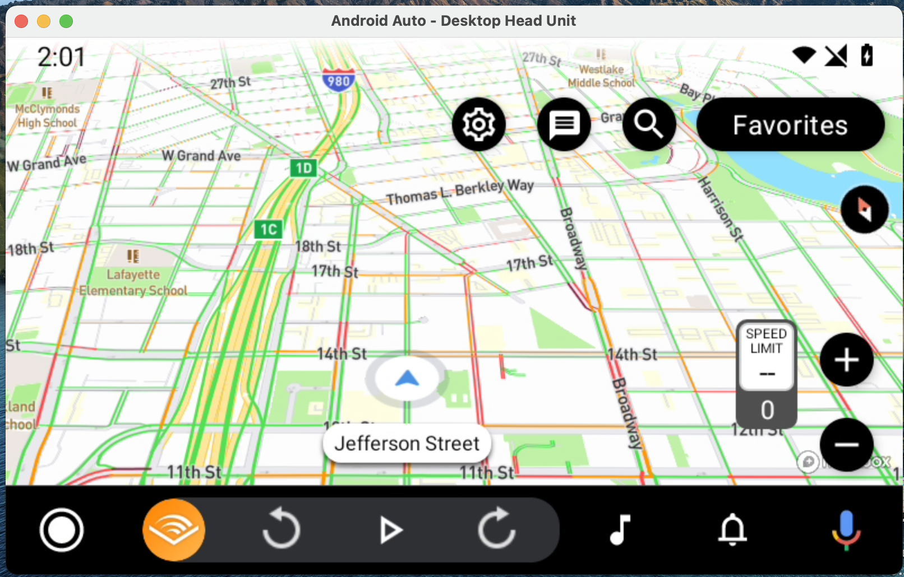
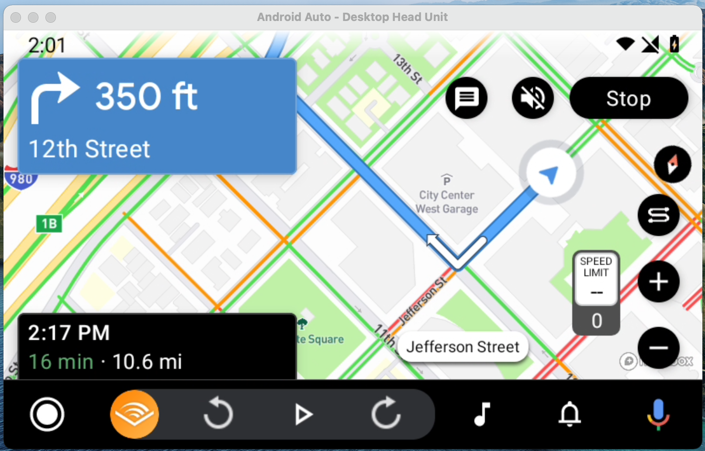

<p align="center">
  
  
</p>

## Overview

The Mapbox Navigation Android Auto SDK is a public library to help you publish Mapbox Android Auto apps to [Google Play](https://play.google.com/store/apps). The library provides everything you need to have an Android Auto Navigation App accepted by Google Play. This library bundles [Mapbox Maps](https://www.mapbox.com/maps), [Mapbox Navigation](https://www.mapbox.com/navigation/), [Mapbox Search](https://www.mapbox.com/search), and the [Jetpack Car Library for Android Auto](https://developer.android.com/jetpack/androidx/releases/car-app).

This library builds on top of the [Mapbox Maps Android Auto Extension](https://github.com/mapbox/mapbox-maps-android/tree/main/extension-androidauto). Please refer to the maps extension for building solutions without Mapbox Navigation.

A simple example can be found in our [qa-test-app](https://github.com/mapbox/mapbox-navigation-android/tree/main/qa-test-app). To see a larger integration, you can refer to the [navigation examples](https://github.com/mapbox/mapbox-navigation-android-examples).

Please refer to [Google's developer documentation](https://developer.android.com/training/cars/navigation) to learn how to develop apps for Android Auto.

## Getting Started

This README is intended for developers who are interested in [contributing](https://github.com/mapbox/mapbox-navigation-android/blob/main/CONTRIBUTING.md) or building an app that uses the Mapbox Navigation Android Auto SDK. To add the android auto extension to your project, you configure its dependency in your `build.gradle` files.

```groovy
// In the root build.gradle file
// The Mapbox access token needs to a scope set to DOWNLOADS:READ
allprojects {
    repositories {
        maven {
            url 'https://api.mapbox.com/downloads/v2/releases/maven'
            authentication {
                basic(BasicAuthentication)
            }
            credentials {
                username = "mapbox"
                password = "INSERT_MAPBOX_ACCESS_TOKEN_HERE"
            }
        }
    }
}

// In your build.gradle, add the android auto sdk with your other dependencies. The ui-androidauto
// library will not be released as often as the Mapbox Navigation and Mapbox Search SDKs. You must
// update them separately.
dependencies {
   implementation 'com.mapbox.navigation:ui-androidauto:0.x.0'

   // Optionally, you can upgrade your versions of navigation and search.
   // Make sure that the release notes the Navigation and Search include the same
   // Mapbox Native Common SDK version as Navigation.
   implementation 'com.mapbox.navigation:android:2.5.+'
   implementation 'com.mapbox.search:mapbox-search-android:1.+'
}
```

## AndroidManifest and CarAppService

You should become familiar with [Google's documentation for building a navigation app](https://developer.android.com/training/cars/apps/navigation). You will need to declare your own [CarAppService](https://developer.android.com/reference/androidx/car/app/CarAppService) to get started. You will also need to specify the `androidx.car.app.category.NAVIGATION` category in order to have the app accepted by Google Play.

``` xml
<manifest xmlns:android="http://schemas.android.com/apk/res/android"
    xmlns:tools="http://schemas.android.com/tools"
    package="com.mapbox.navigation.testapp">

    <application
        <!-- snip -->
        >

        <!-- Link to your implementation of CarAppService -->
        <service
            android:name=".car.MainCarAppService"
            android:exported="true"
            tools:ignore="ExportedService"
            android:foregroundServiceType="location">

            <intent-filter>
                <action android:name="androidx.car.app.CarAppService" />
                <category android:name="androidx.car.app.category.NAVIGATION" />
            </intent-filter>
        </service>
    </application>
</manifest>
```

## Example MainCarAppService

```
class MainCarAppService : CarAppService() {
    override fun createHostValidator() = HostValidator.ALLOW_ALL_HOSTS_VALIDATOR

    override fun onCreateSession() = MainCarSession()
}
```

The `MainCarSession` example is where you will implement your Android Auto experience. All the building blocks are included in the SDK, but you will need to decide how to use them yourself. Mapbox is also simplifiying and solidifying this architecuture. Please refer to `MapboxCarMap` and `MapboxNavigationApp`. `MapboxCarMap` will make the Mapbox Map show on the Android Auto head unit, you can add/remove elements with `MapboxCarMapObserver`. Similarly, `MapboxNavigationApp` helps you to customize the entire turn-by-turn navigation experience.

## Testing

Please refer to [Google training documentation](https://developer.android.com/training/cars/testing) to use the ./desktop-head-unit.

tl;dr here. You need to run an emulator to test Android Auto.
Testing in real cars, requires publishing your app to Google Play.

1. Install the emulator: SDK Manager > SDK Tools > Android Auto Desktop Head Unit Emulator > **install**
1. Make sure you have the Android Auto app on your phone https://play.google.com/store/apps/details?id=com.google.android.projection.gearhead
1. Android Auto App, enable developer settings by tapping on device info and then version info
1. Android Auto App > click the hamburger on the top right > Start head unit server
1. Set the `ANDROID_HOME` environment variable to your android SDK location (e.g., /Users/{user}/Library/Android/sdk)
1. $ make car
   1. $ adb forward tcp:5277 tcp:5277
   1. $ cd $(ANDROID_HOME)/extras/google/auto/
   1. $ ./desktop-head-unit
